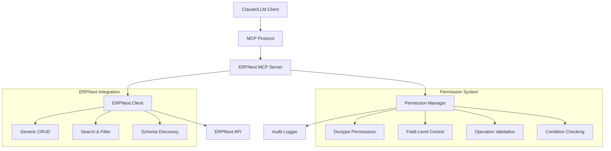

# ERPNext MCP Server

A comprehensive **Model Context Protocol (MCP) server** for ERPNext that provides **generic, doctype-agnostic access** to any ERPNext document type with **robust permission controls**, **audit logging**, and **enterprise-grade security**.

## Architecture Overview



### Core Components

- **Generic Client** — Works with any ERPNext doctype (Customer, Item, Sales Invoice, GL Entry, Client Script, etc.)
- **Permission System** — Multi-layer access control with field-level restrictions
- **Audit System** — Comprehensive logging of all operations
- **Performance** — Built-in caching and rate limiting
- **Discovery** — Dynamic tool generation based on configured doctypes

---

## Quick Start

### 1. Clone & Install

```bash
git clone https://github.com/Sheikh-Muhammad-Mujtaba/ErpNext-MCP.git
cd ErpNext-MCP/

# Create virtual environment
uv sync
source .venv/bin/activate        # Windows: .venv\Scripts\activate

# Install dependencies
uv pip install -r requirements.txt
```

### 2. Configure Environment

Create a `.env` file in the project root:

```bash
ERPNEXT_URL=https://your-erpnext-instance.com

# api key or username/password
ERPNEXT_API_KEY=your_api_key
ERPNEXT_API_SECRET=your_api_secret

ERPNEXT_USERNAME=username
ERPNEXT_PASSWORD=pass
```

### 3. Configure Permissions

Edit `config/config.json`:

```json
{
  "erpnext": {
    "timeout": 30
  },
  "permissions": {
    "doctypes": {
      "Customer": {
        "read": true,
        "create": true,
        "update": true,
        "delete": false,
        "allowed_fields": ["customer_name", "email_id", "mobile_no"],
        "conditions": {
          "create": {"customer_type": ["Company", "Individual"]}
        }
      }
    },
    "default": {
      "read": true,
      "create": true,
      "update": false,
      "delete": false
    }
  },
  "audit": {
    "enabled": true,
    "log_file": "logs/audit.log",
    "log_level": "INFO"
  },
  "rate_limiting": {
    "enabled": true,
    "requests_per_minute": 60,
    "requests_per_hour": 1000
  },
  "cache": {
    "enabled": true,
    "ttl": 300,
    "max_size": 1000
  }
}
```

### 4. Run the Server

```bash
python -m src.server
```

---

## Connect to Claude Code

### User-scoped (available across all projects)

```bash
claude mcp add erpnext -s user -- bash -c "cd '/path/to/ERP_Next-MCP' && .venv/bin/python -m src.server"
```

### Project-scoped (current directory only)

```bash
claude mcp add erpnext -- bash -c "cd '/path/to/ERP_Next-MCP' && .venv/bin/python -m src.server"
```

### Verify connection

```bash
claude mcp list
```

### Claude Desktop Integration

Add to `claude_desktop_config.json`:

```json
{
  "mcpServers": {
    "erpnext": {
      "command": "bash",
      "args": ["-c", "cd '/path/to/ERP_Next-MCP' && .venv/bin/python -m src.server"],
      "env": {
        "MCP_LOG_LEVEL": "INFO"
      }
    }
  }
}
```

---

## Available MCP Tools

### System Tools

| Tool | Description |
|------|-------------|
| `test_connection` | Test ERPNext server connectivity |
| `get_system_info` | Get ERPNext system information |
| `list_doctypes` | List all configured doctypes and permissions |
| `get_doctype_permissions` | Get detailed permissions for a specific doctype |
| `get_doctype_schema` | Get schema/metadata for any doctype |

### Generic Document Tools

| Tool | Description |
|------|-------------|
| `get_generic_document` | Get any document by doctype and name |
| `list_generic_documents` | List documents for any doctype with filters |
| `create_generic_document` | Create a document for any doctype |
| `update_generic_document` | Update a document for any doctype |

### Customer-Specific Tools

| Tool | Description |
|------|-------------|
| `list_customer_documents` | List customers with optional filters |
| `get_customer_document` | Get a specific customer by name |
| `search_customer_documents` | Search customers by text |
| `create_customer_document` | Create a new customer |
| `update_customer_document` | Update an existing customer |

> For each doctype configured in `config.json`, the server auto-generates:
> `list_`, `get_`, `search_`, `create_`, `update_`, and `delete_` tools.

---

## Known Limitations

- **`list_generic_documents` only returns `name` fields** — field filtering in the `fields` parameter is not applied by the list endpoint; use `get_generic_document` to retrieve full document details.
- The list endpoint is capped at **100 results** per call.
- Aggregated queries (SUM, COUNT, GROUP BY) are not supported — use ERPNext's built-in reports for financial summaries.

---

## Permission Model

### Multi-Layer Security

#### 1. Operation-Level
```json
{
  "Customer": {
    "read": true,
    "create": true,
    "update": true,
    "delete": false
  }
}
```

#### 2. Field-Level Access Control
```json
{
  "Customer": {
    "allowed_fields": ["customer_name", "email_id", "mobile_no"],
    "restricted_fields": ["creation", "modified", "owner", "credit_limit"]
  }
}
```

#### 3. Conditional Validation
```json
{
  "Customer": {
    "conditions": {
      "create": {
        "customer_type": ["Company", "Individual"]
      },
      "update": {
        "status": {"not_in": ["Disabled", "Blocked"]}
      }
    }
  }
}
```

#### 4. Audit Logging
```json
{
  "audit": {
    "enabled": true,
    "log_file": "logs/audit.log",
    "log_level": "INFO"
  }
}
```

### Example Configurations

#### Read-only analyst
```json
{
  "permissions": {
    "doctypes": {
      "Customer": {
        "read": true, "create": false, "update": false, "delete": false,
        "allowed_fields": ["name", "customer_name", "territory", "customer_group"]
      },
      "Sales Invoice": {
        "read": true, "create": false, "update": false, "delete": false,
        "allowed_fields": ["name", "customer", "grand_total", "status", "posting_date"]
      }
    }
  }
}
```

#### Sales user
```json
{
  "permissions": {
    "doctypes": {
      "Customer": {
        "read": true, "create": true, "update": true, "delete": false,
        "allowed_fields": ["customer_name", "customer_type", "email_id", "mobile_no", "territory"],
        "conditions": {
          "create": {"customer_type": ["Company", "Individual"]},
          "update": {"status": {"not_in": ["Disabled"]}}
        }
      }
    }
  }
}
```

---

## Example Prompts

### Fetch a document
```
Get the Client Script document named "Sales Invoice"
```

### List documents
```
List all Client Script documents
```

### Financial queries
```
Get GL Entry ACC-GLE-2025-113787
```

### Search
```
Search customer documents for "National"
```

### Cross-doctype analysis
```
Get the Sales Invoice ACC-SINV-2025-06622 and show me the items and COGS
```

---

## Security

### Authentication
- Uses ERPNext API Key/Secret — no passwords stored
- Credentials loaded from `.env` file (never commit this file)
- Supports ERPNext user-level role permissions

### Generate API Keys in ERPNext
1. Go to **Settings > Integrations > API Access**
2. Click **Generate Keys**
3. Assign the API user appropriate roles (e.g., "Accounts User", "Sales Manager")
4. Copy the key and secret into your `.env` file

### Network
- HTTPS-only connections to ERPNext
- Configurable request timeouts
- Rate limiting: 60 req/min, 1000 req/hour (configurable)

### Audit Trail

All operations are logged with timestamp, operation type, doctype, and result:

```
2025-08-29 11:18:35 - INFO - Operation: READ | DocType: Sales Invoice | Result: ALLOWED | Document: ACC-SINV-2025-06622
2025-08-29 11:18:35 - WARNING - Operation: DELETE | DocType: Customer | Result: DENIED | Reason: Delete not permitted
```

---

## Testing

```bash
python test.py
```

---

## Project Structure

```
ERP_Next-MCP/
├── src/
│   ├── server.py          # MCP server entry point
│   ├── erpnext_client.py  # ERPNext API client
│   └── permissions.py     # Permission manager
├── config/
│   ├── config.json        # Main configuration
│   ├── multi_doctype_config.json
│   └── restricted_config.json
├── logs/
│   └── audit.log
├── .env                   # API credentials (not committed)
├── .env.example           # Example env file
├── requirements.txt
└── test.py
```
